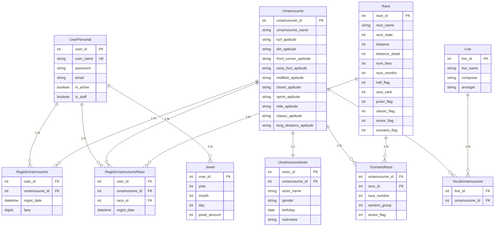

ウマ娘全冠・因子厳選サポートツールのバックエンドAPI

## 概要

Django REST Frameworkを使用して構築された、ウマ娘の育成をサポートするためのバックエンドAPIです。ユーザー認証、ウマ娘のデータ管理、レース情報の提供、育成パターンの計算など、多岐にわたる機能を提供します。

## 技術スタック

- **Framework**: Django 4.2.5
- **API**: Django REST Framework 3.14.0
- **Database**: PostgreSQL
- **Authentication**: djangorestframework-simplejwt (JWT)
- **Language**: Python 3.x
- **Other**: django-cors-headers, psycopg2

## 主要機能

- **認証機能**: ユーザー登録・ログイン、JWTによるセキュアなAPIアクセス。
- **ウマ娘管理**: ウマ娘の基本情報、適性情報の管理。ユーザーごとの所持ウマ娘、ファン数、出走済みレースの記録。
- **レース管理**: G1/G2/G3レース情報の提供。条件（馬場、距離など）による検索。
- **育成パターン計算**:
    - ユーザーの未出走レース状況に基づき、全冠達成のための最適な育成ローテーションを複数パターン提案。
    - ラーク、メイクラなどのシナリオや、ウマ娘の適性を考慮した因子補強戦略を自動で計算。
- **因子計算**: 親・祖父母の組み合わせから、継承される適性因子を計算。
- **ジュエル管理**: 日々のジュエル所持数を記録・管理。

## API エンドポイント

<details>
<summary>エンドポイント一覧</summary>

### ユーザー関連 (`/api/user/`)
*   `POST /api/user/register`: ユーザー新規登録
*   `POST /api/user/login`: ログイン
*   `POST /api/user/logout`: ログアウト
*   `GET /api/user/data`: ログイン中ユーザーの情報を取得

### ウマ娘関連 (`/api/umamusume/`)
*   `GET /api/umamusume/list`: 全ウマ娘の一覧を取得
*   `GET /api/umamusume/regist-list`: ユーザーが未登録のウマ娘一覧を取得
*   `POST /api/umamusume/regist`: ウマ娘をユーザーに登録
*   `GET /api/umamusume/user-regist`: ユーザーが登録済みのウマ娘一覧を取得
*   `POST /api/umamusume/fan-up`: 登録済みウマ娘のファン数を更新

### レース関連 (`/api/race/`)
*   `POST /api/race/list`: レース一覧を条件付きで取得
*   `GET /api/race/regist-list`: ウマ娘登録時に使用するG1/G2/G3レース一覧を取得
*   `GET /api/race/remaining`: ユーザーのウマ娘ごとの未出走レース情報を取得
*   `POST /api/race/remaining-to-race`: 指定した時期の未出走レースを取得
*   `POST /api/race/run`: レースの出走を記録
*   `POST /api/race/pattern`: 最適なレースパターンを計算して取得

### その他
*   `GET /api/acter/list`: 声優情報一覧を取得
*   `GET /api/live/list`: ライブ情報一覧を取得
*   `POST /api/live/umamusume`: ライブに参加しているウマ娘一覧を取得
*   `POST /api/jewel/list`: 指定した月のジュエル履歴を取得
*   `POST /api/jewel/regist`: 当日のジュエル数を登録
*   `GET /api/factor/calculate`: 継承因子を計算

</details>

## データベース設計

### ER図



## セットアップ

### 1. Dockerを使用する場合（推奨）
プロジェクトルートに`.env`ファイルを作成し、環境変数セクションを参考に設定してください。

```bash
# コンテナをビルドして起動
docker-compose up --build -d

# データベースのマイグレーション
docker-compose exec backend python manage.py migrate

# 初期データの投入
docker-compose exec backend python manage.py load_data
```

### 2. ローカル環境で直接実行する場合
**前提条件**
- Python 3.x
- PostgreSQL
- pip

**インストール**
```bash
# 依存関係のインストール
pip install -r requirements.txt

# データベース設定 (settings.pyを編集)
# マイグレーション
python manage.py migrate

# 初期データの投入
python manage.py load_data

# 開発サーバー起動
python manage.py runserver
```

## 環境変数

プロジェクトのルートディレクトリに`.env`ファイルを作成し、以下の内容を記述してください。

```env
# Django Secret Key (本番環境では必ず変更してください)
SECRET_KEY=your-secret-key

# PostgreSQL Database Settings
POSTGRES_DB=your_db_name
POSTGRES_USER=your_db_user
POSTGRES_PASSWORD=your_db_password
DB_HOST=db # Docker環境の場合。ローカルの場合は 'localhost'
```

## ログ機能

- APIアクセスログ: `uma_api.log`
- リクエスト/レスポンス詳細記録
- エラートラッキング

## 開発者向け情報

### モデル構造
- **UserPersonal**: カスタムユーザーモデル
- **Umamusume**: ウマ娘基本情報
- **Race**: レース情報
- **RegistUmamusume**: ユーザー別ウマ娘登録
- **Jewel**: ジュエル管理

### 認証方式
JWT Tokenベースの認証を使用。ヘッダーに`Authorization: Bearer <token>`を設定。